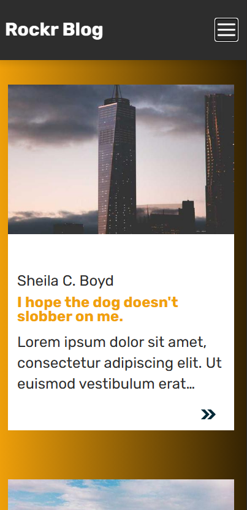
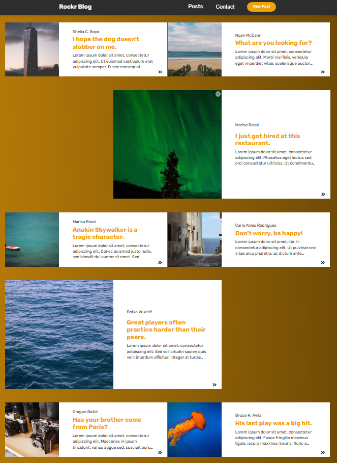
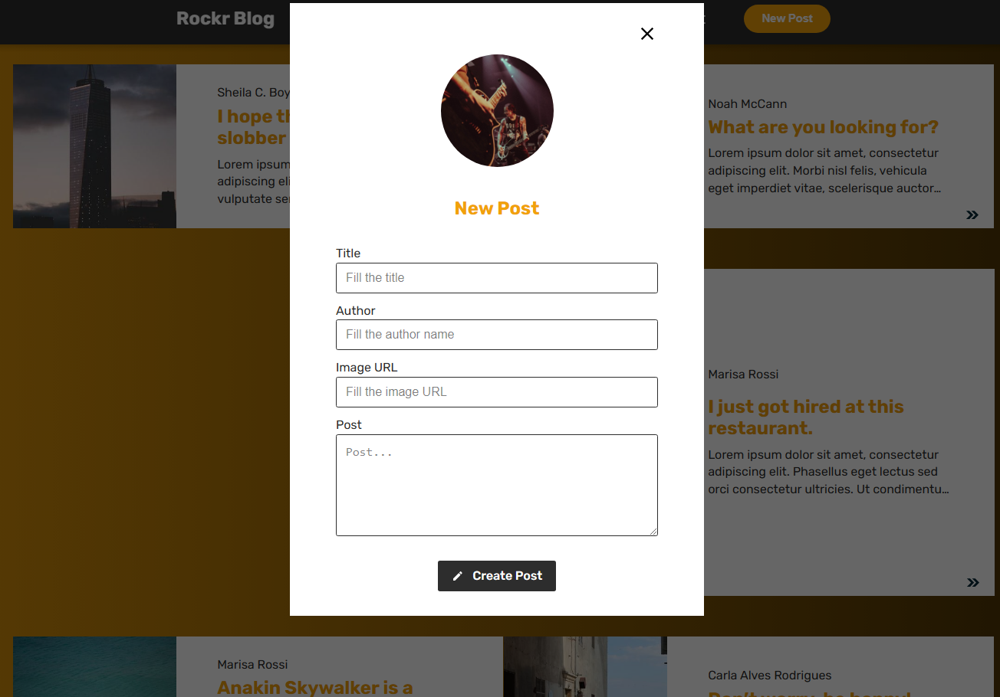

# Rockr Blog

<br />

> Projeto responsivo que trás uma listagem de posts com scroll infinito, acesso a posts individuais e modais de inserção.

<br />

</img>
</img>
</img>

<br />
<br />

## Tecnologias

- React (vite)
- Typescript
- sass
- Node

<br />

## Bibliotecas

- aos (animações)
- axios (requisições)
- date-fns (formatação de datas)
- react-hook-form (manipulação de formulário)
- react-icons (ícones)
- react-router-dom (rotas)
- react-spinners (componentes visuais durante carregamentos)

<br />

## Padrões de código

- Eslint
- Prettier
- .EditorConfig

<br />
<br />

## Como rodar o projeto:

<br />

Clonar:

```sh
git clone https://github.com/matheuspedrosoo/rockrblog.git rockerblog
```

Entrar no diretório baixado:

```sh
cd rockerblog
```

Instalar as dependências:

```sh
yarn ou npm install
```

Rodar projeto:

```sh
yarn dev
```

ou

```sh
 npm run dev
```

acessar:

```sh
 http://localhost:5173/
```

<br />

<div align="center">

## Desenvolvido Por :

Matheus Pedroso – [Linkedin](https://www.linkedin.com/in/matheuspedrosoo/)

</div>
